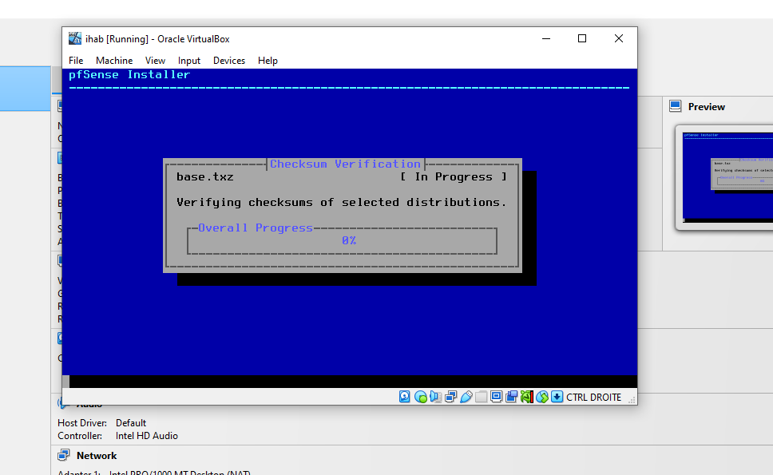
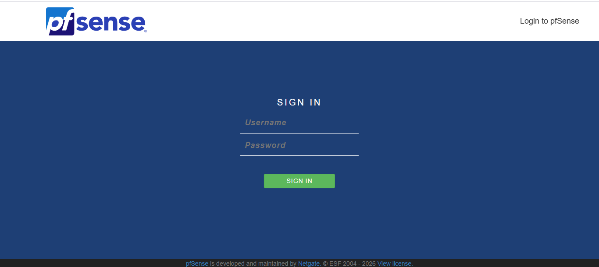
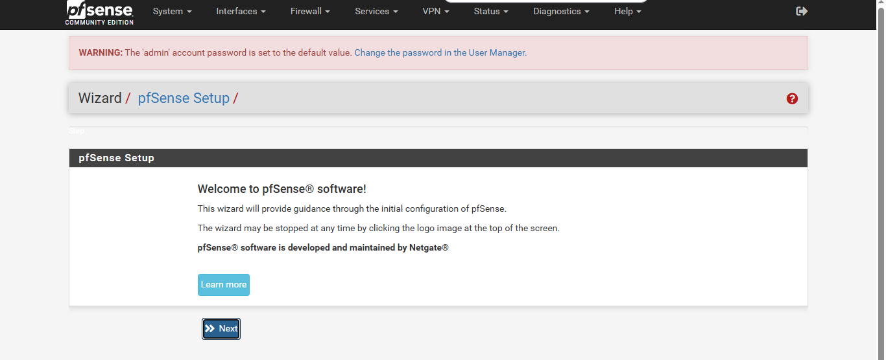
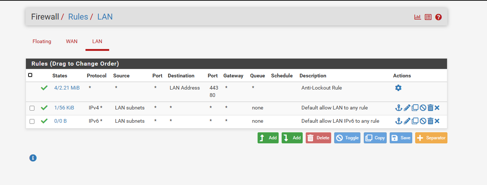
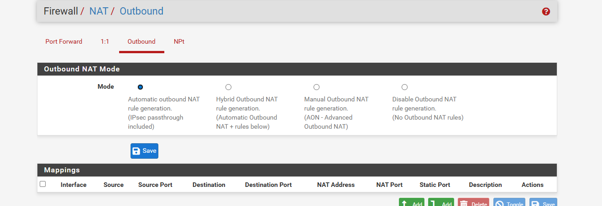
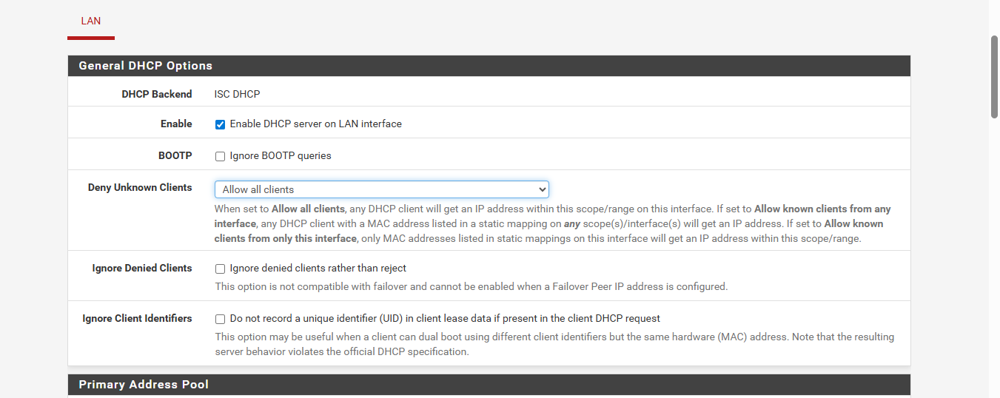
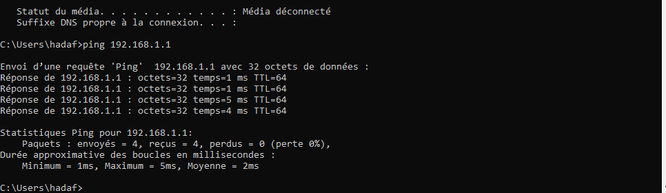
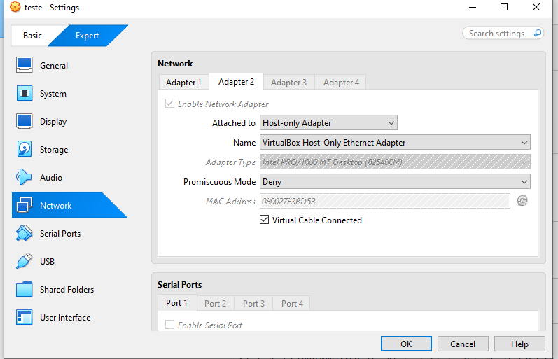

# 🔥 pfSense Firewall Lab

## 📌 Description

This project demonstrates the implementation of a **pfSense firewall** in a virtual environment using **VirtualBox**, including network configuration, DHCP services, and firewall rule management.

---

## ⚙️ Tools Used

* pfSense
* VirtualBox
* Networking (IP, Subnet, Gateway)

---

## 📊 Features

* WAN / LAN Configuration
* DHCP Server Configuration
* Network Connectivity Testing (ping)
* Firewall Rules Analysis
* Web Interface Access (WebConfigurator)

---
## 📸 Screenshots

### 🔹 Installation

### 🔹 Login Interface

### 🔹 Setup Wizard

### 🔹 Firewall Rules

### 🔹 NAT Configuration

### 🔹 DHCP Configuration

### 🔹 Ping Test

### 🔹 Network Configuration

---

## 🧠 Skills Gained

* Firewall configuration
* Network troubleshooting
* IP addressing and subnetting
* Understanding security rules

---

## ✅ Result

A fully functional network where pfSense acts as:

* Router
* Firewall
* DHCP Server

---

## 🚀 Future Improvements

* Advanced firewall rules
* Website blocking
* IDS/IPS (Snort / Suricata)

---
